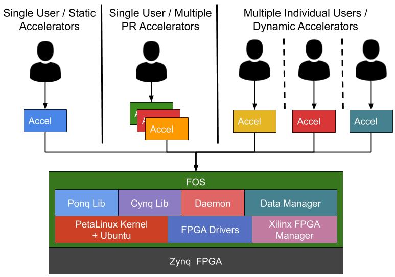
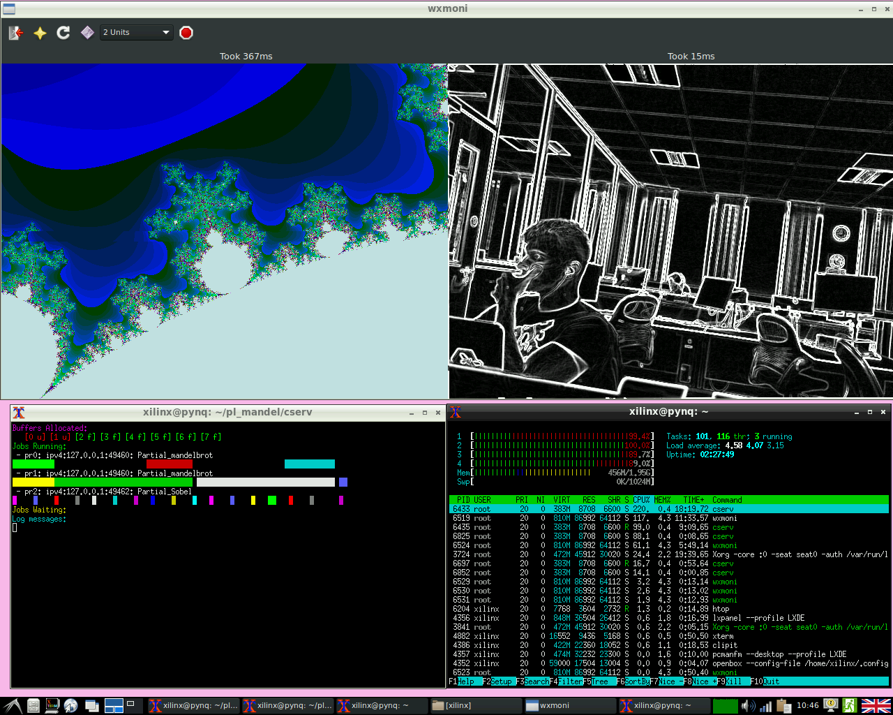

# FOS - FPGA Operating System Demo

FOS extends the ZUCL framework with linux integration, python libs, C++ runtime management to provide support for: *multi-tenancy (concurrent processes with hardware accel.), dynamic offload, GUI, network connection and flexibility*.

With FOS, you can use HLS or RTL accelerators in standard static accelerator mode, single process (library mode) with partially reconfigurable accelerators or multiple processes (daemon mode) with dynamic reconfiguration support. 
This allows users to easily program accelerators with its in-built driver support for AXI master and slave interface (as well as libs to build your own drivers). 

Moreover, the accelerator development, shell development and user application development can be performed in isolation as FOS provides built-in modularity and abstraction levels. 

The aim of this project is to make FPGAs easy to use and allow the deployment and development of FPGA systems at scale. We hope FOS can improve your productivity and make FPGAs more fun to use while retaining its performance and energy.

## Key Features

- **Accelerate on the go:** Use accelerators with dynamic partial reconfiguration.
- **The more the merrier:** Runtime support for concurrent hardware accelerators.
- **Compile where you run:** Compile bitstreams *on board* with [EFCAD tool flow.](https://github.com/khoapham/efcad)
- **Compile once, run everywhere:** Relocate  bitstream to any slot in the shell.
- **Accelerators come in all sizes:** Combine partial regions for big accelerators.
- **Free to change:** Update shell, accelerator, application or Linux individually. 
- **Abstraction to rescue:** Ponq and Cynq libs for easy hardware integration.
- **Don't repeat yourself:** Standard Linux backend for software development.
- **Don't forget your I/O:** All types of I/Os (from monitors to storage to network) are supported via host CPU.

## Quick Getting Started

- Download SD Card image
- Set board to SD Card mode and turn it on
- login with username `xilinx` password `xilinx`
- open a terminal for the server:
  - `cd fos`
  - `sudo ./runServer`
- open a terminal for the client:
  - `cd fos`
  - `sudo ./runServer`

## Tutorials

- [How to write HLS accelerators](./compilation_flow/hls/)
- [How to use Ponq](./ponq/)
  - [How to use static accelerator](./ponq/README.md#usage-static-full-bitstream)
  - [How to use partially reconfigurable accelerators](./ponq/README.md#usage-dynamic-partial-bitstream-automatic)
- How to use Cynq
- [How to use Daemon mode](./clients#usage-standard-flow)
- [How to compile partially reconfigurable modules](./compilation_flow/pr_flow/)
- [How to build/download Linux (Pynq / Ubuntu) image](./sd_card_images)
- [How to use Linux image as standalone](./standalone_code/Sobel)

## Compatibility

Target board: Ultra96 (can be ported to ZCU102, UltraZed easily)

The source code presented has been tested with following tool versions:
- Vivado and Vivado HLS 2016.2, 2017.3, 2018.2 and 2018.3.
- PetaLinux kernel 2018.2.
- Rootfs: Pynq, PetaLinux, Ubuntu 18, Ubuntu 14, Debian, Linaro u96.
- GRPC version: 2019-09

## Papers

If you found FOS useful please consider citing following paper:

- A. Vaishnav, K.D. Pham, K. Manev and D. Koch, "**FOS (FPGA Operating System) Demo**", FPL, 2019. 

If you would like to learn more about how the system works or what it can do in detail, you can read the following papers.

Hardware: 
- K.D. Pham, A. Vaishnav, M. Vesper and D. Koch, "**ZUCL: A ZYNQ UltraScale+ Framework for OpenCL HLS Applications**", 5th FSP, 2018.
- K.D. Pham, E. Horta and D. Koch, "**BITMAN: A tool and API for FPGA bitstream manipulations**", DATE, 2017.

- K.D. Pham, M. Vesper, D. Koch and E. Hung, "**EFCAD -- An Embedded FPGA CAD Tool Flow for Enabling On-chip Self-Compilation**", FCCM, 2019.

Software: 
- A. Vaishnav, K.D. Pham, D. Koch and J. Garside, "**Resource Elastic Virtualization for FPGAs using OpenCL**", 28th FPL, 2018.
- A. Vaishnav, K.D. Pham and D. Koch, "**Live Migration for OpenCL FPGA Accelerators**", FPT, 2018. 
- A. Vaishnav, K.D. Pham and D. Koch, "**Heterogeneous Resource-Elastic Scheduling for CPU+FPGA Architectures**", 10th HEART, 2019.

## License information

This work is released as free to use and modify for non-commercial purposes as long as the original license and source of development is retained. The exact details of the license can be found [here](./LICENSE.md).

## Get in Touch 

If you would like to ask questions, report bugs or collaborate on research projects, please email any of the following: 

- Anuj Vaishnav (<anuj.vaishnav@manchester.ac.uk>)
- Khoa Dang Pham (<khoa.pham@manchester.ac.uk>)
- Dirk Koch (<dirk.koch@manchester.ac.uk>)

## Contributors
Anuj Vaishnav, Khoa Dang Pham, Joe Powell, Alasdair Olway, Kyriakos Paraskevas, Andrew Attwood, Dirk Koch 

## Acknowledgments
- This work was produced at the University of Manchester as part of PhD and MPhil Projects. 
- This work is supported by the Xilinx University Program. 

