# Vivado HLS Compilation Flow: From Software to Hardware

## Introduction

Here we provide a step-by-step tutorial on how to generate a static bitstream. We use the Sobel edge detection algorithm as an example to demonstrate the process. However, the steps remain the same for other modules you may want to create. 
## Contents
  - [Set-up](#set-up) 
  - [Creating a Custom Module with Vivado HLS](#phase-1-creating-a-custom-module-with-vivado-hls)
  - [Using Your Custom Module in Vivado](#phase-2-using-your-custom-module-in-vivado)
  - [Misc](#misc)
  - [Known Issues](#known-issues)
  
## Set-up
Listed below are the tools that I used to generate the static bitstream of a Sobel algorithm:

### Tools Used:
  - [Vivado 2018.3](https://www.xilinx.com/support/download/index.html/content/xilinx/en/downloadNav/vivado-design-tools/2018-3.html)
  - Ubuntu 16.04.5 LTS
  - [Avnet Ultra96v1 Development Board](https://www.avnet.com/shop/us/products/avnet-engineering-services/aes-ultra96-g-3074457345634920668/?aka_re=1)
  - OpenCL, OpenCV, C/C++
  - [Sobel OpenCL Code](https://github.com/Xilinx/SDAccel_Examples/tree/1e273f6ef01073f878a4c2b5ca4d6ad5aec7e616/vision/edge_detection)
  
## Phase 1: Creating a Custom Module with Vivado HLS

### Step 1 - Creating a New Project

1.  To create a new project go to **File** > **New Project**
2.  You'll be greeted by this screen:

    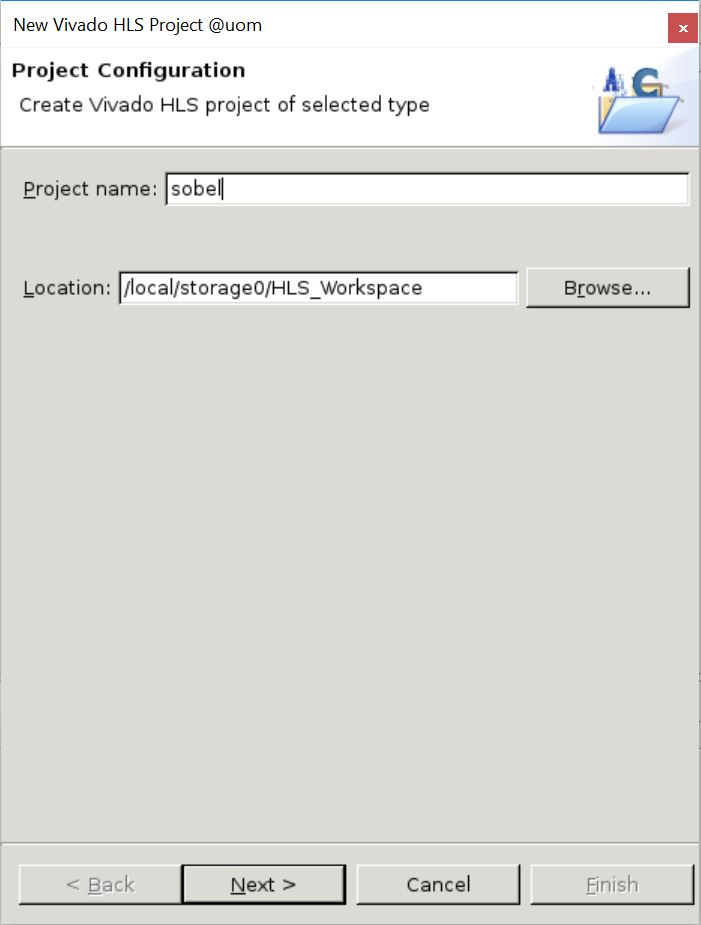\
    Choose a suitable name and location for the project.
3.  Next, enter the name of the main function in the program. In our case, this is krnl_sobel. From here you can import the source file. You can also import the source files later on in the process, I will point this out. 

    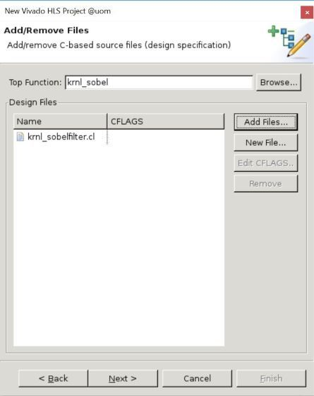

4.  The same applies to the testbench files. 

    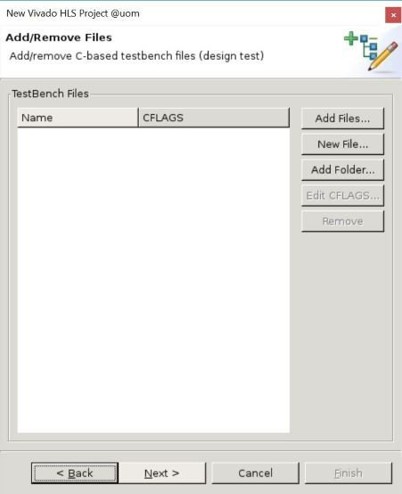
  
5.  This screen allows us to tailor our module to a certain architecture. Click the 3 dots in the 'Part Selection' area of the next window. From this window, you can pick a specific FPGA or board. In this tutorial, we are selecting a specific board to synthesise our module for. It should be noted that Vivado 2018.3 does not contain an entry for the Ultra96 platform. However, when designing the modules, we found that it works fine by using the ZCU102 platform as they both use the same ZYNQ FPGA. 

    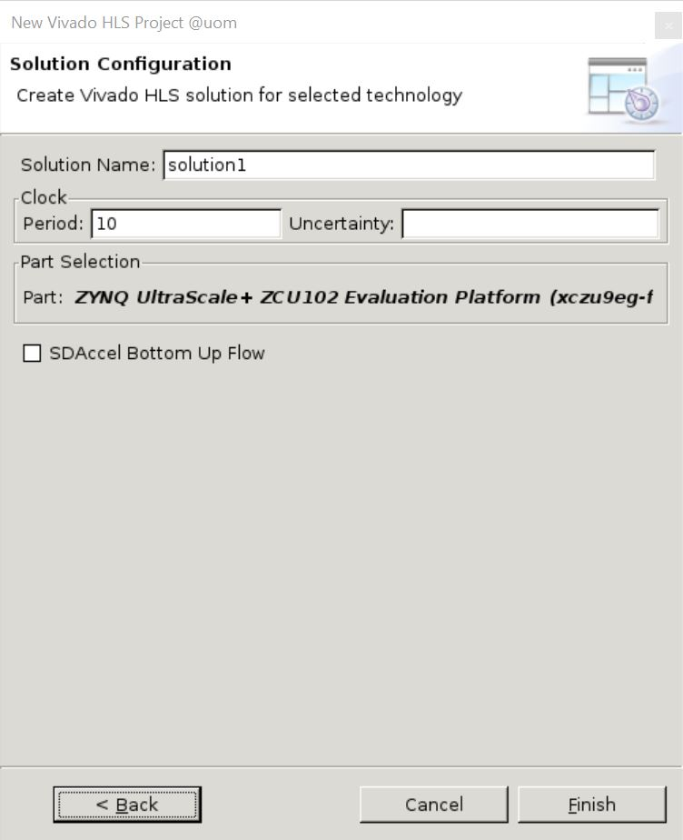

    We don't need to worry about any of the options in the clock section of the window. You can choose a different name for your solution.
6.  The final thing to do is select the **Finish** button.
7.  From here right-click on the source in the **Explorer** menu and select **New File...**. From here you navigate to the directory that contains the source files you want to import. The same goes for 'Test Bench' in the same **Explorer** menu. It should be noted that you should include any header files or test data that the module needs to be tested.

    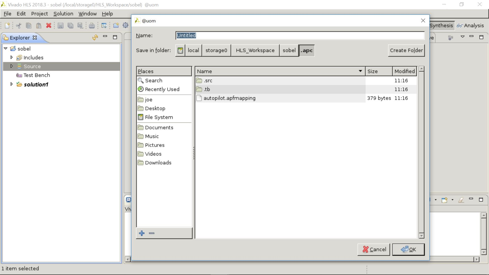

8.  You can view and modify the source code by opening the file from the **Source** directory. For this tutorial, the source code will synthesise without modification. The ['Misc'](#misc) section contains modifications that we made to source code, such that it would be compatible with the larger project. 

    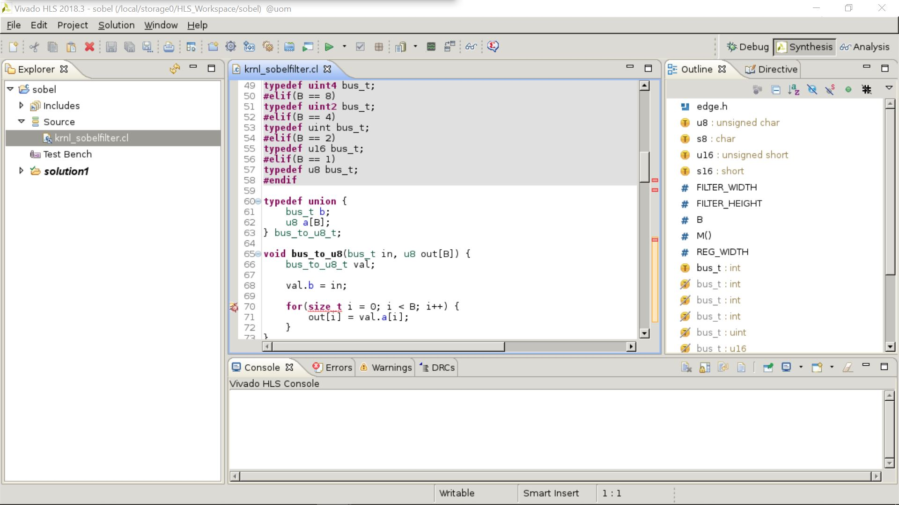
  
### Step 2 - C Simulation

### Step 3 - Synthesis & Creating the RTL Module

1.  The button to start synthesis is  the green triangle. 

    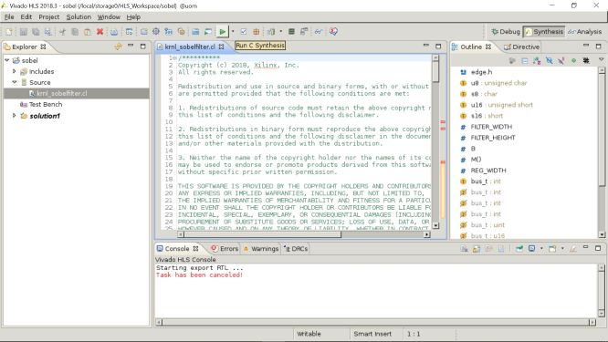
  
2.  If synthesis was successful, this tab should appear: 

    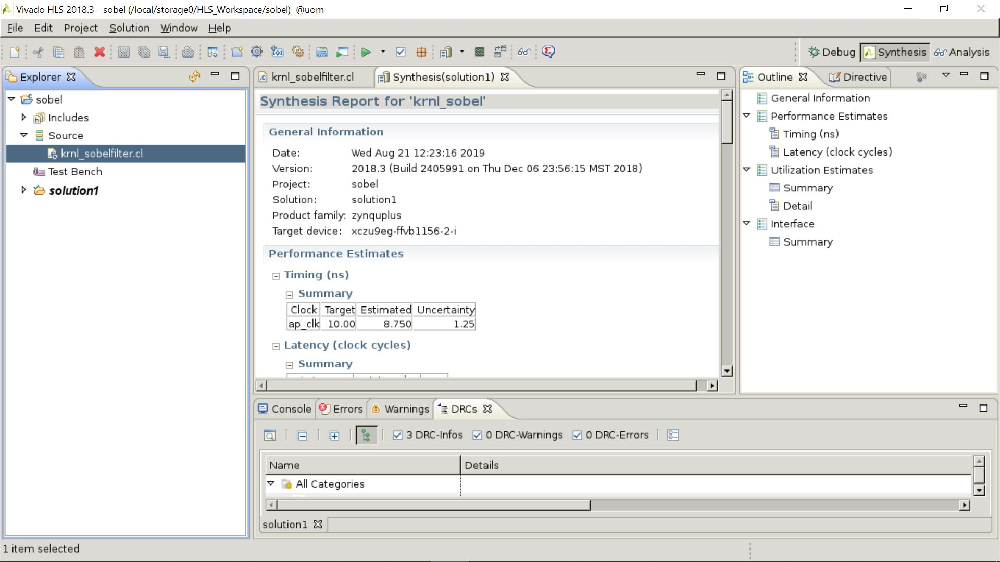

    This tab contains information about the interface that was generated. For example, bus widths for the slave and master AXI ports
3.  To create the RTL module to use in the Vivado block diagram, you just simply press the 'Export RTL' button. 

    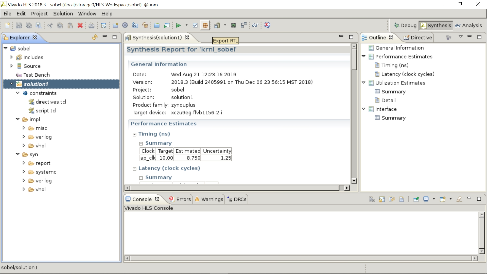

4.  This menu appears: 

    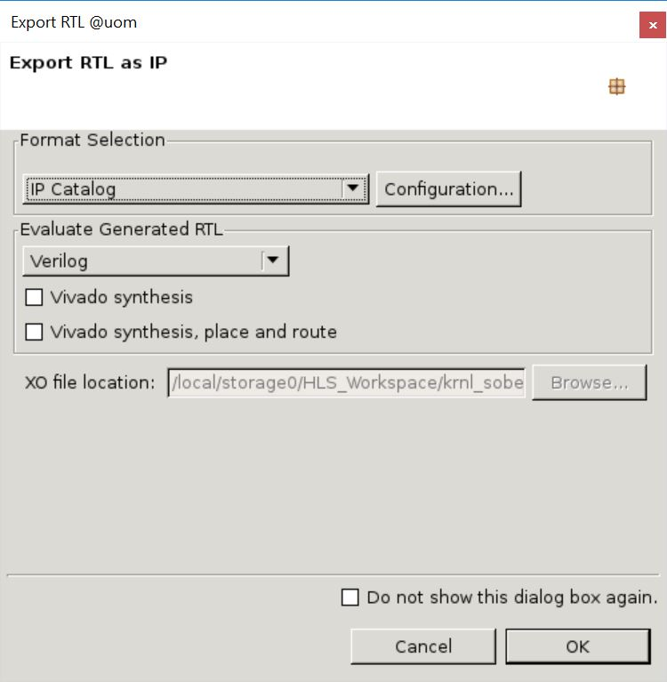
    
    For this tutorial, you can leave these options as the defaults.

## Phase 2: Using Your Custom Module in Vivado

### Step 1 - Create a New Project 
1.  To create a new project, go to **File** > **Project** > **New...**
2.  Navigate to the following screen by pressing next: 

    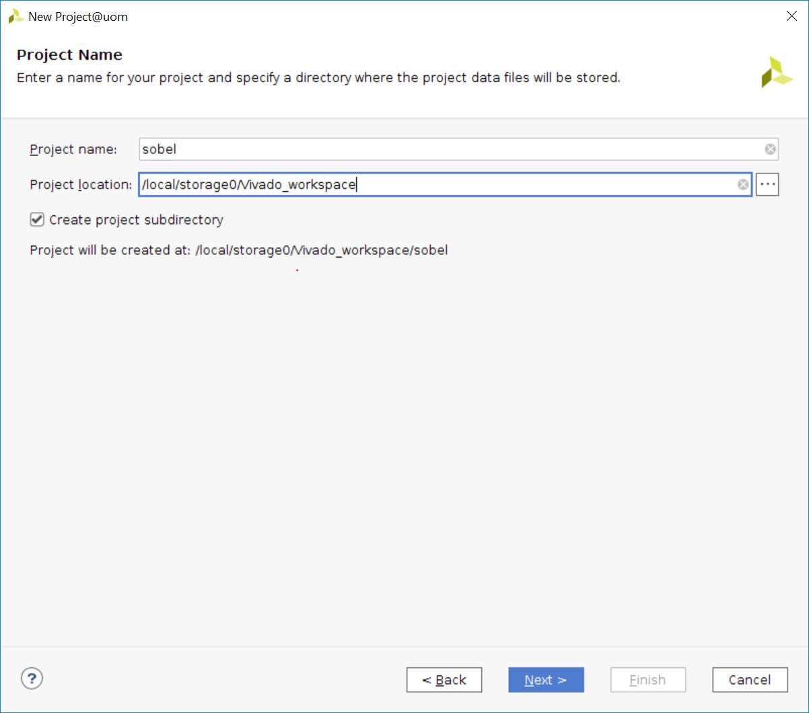

    Choose a suitable name and location for the new project before continuing
3.  For this tutorial select **RTL Project** option in the next menu
4.  The next window is one way of adding source files to the block design: 

    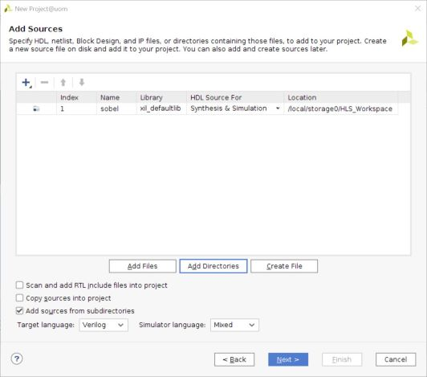

    For this tutorial, we use a different method. However, both are equal
5.  We will not be adding any constraints in this tutorial
6.  For the default part menu, we will be going to **Boards** and selecting the Ultra96v1 Evaluation Platform

    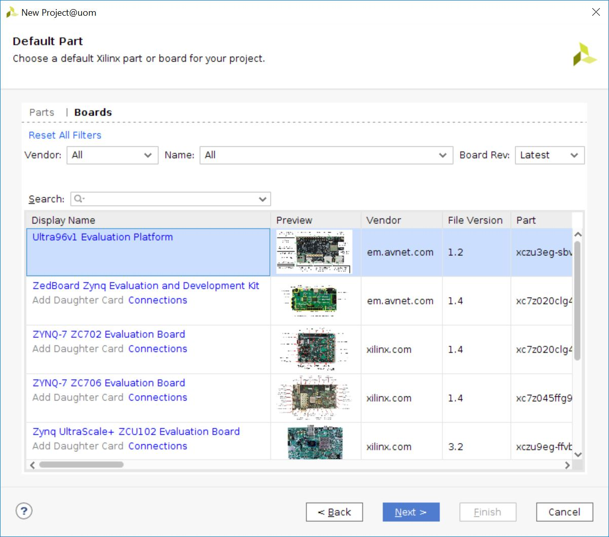
    
7.  If all is well, you can click the **Finish** button and get started with a block diagram
8.  From this next window, you can add your sobel module. Just go to **Tools** > **Settings...** > **IP** > **Repository**
    
    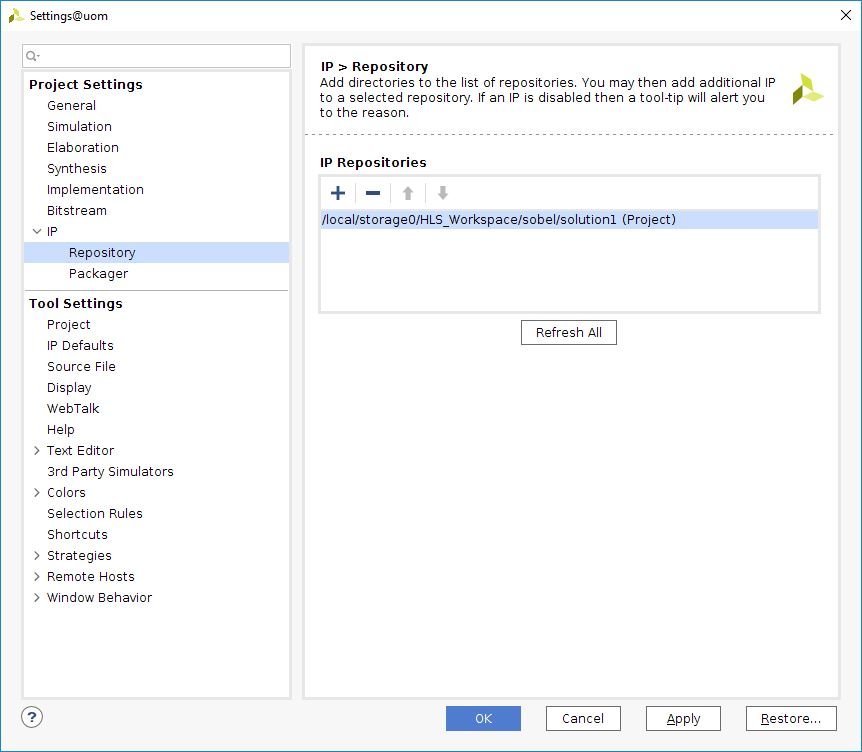

    From here, go to **Add** and then navigate to where you stored your sobel module. Note, only the folder needs to be selected, Vivado will automatically detect the IP inside. Once this is done, click **Apply** and **OK**
### Step 2 - Creating the Block Design

1.  From the Flow Navigator menu of the Vivado window, you can select the **Create Block Design** option to get started
    
    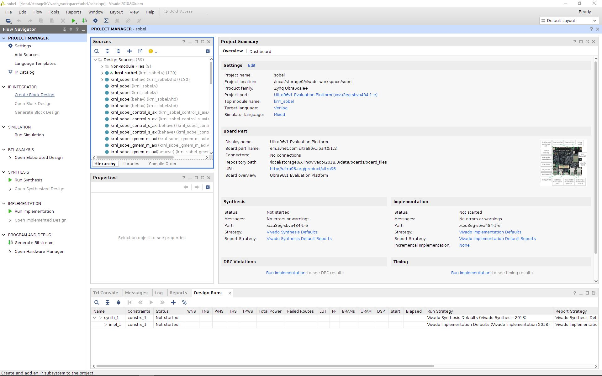

    Keep everything the same except the design name, which can be changed at your discretion. 
2.  From the **Diagram** section of the Vivado window, you can click the **+**, or press **CTRL + I**, to add new IP to the diagram
3.  Start by getting the block that represents your processing system, PS. For this tutorial, we use the Zynq Ultrascale+ MPSoC PS. Then click the 'Run Block Automation' link from the pop up that appears. Make sure the PS is selected and click **OK** 

    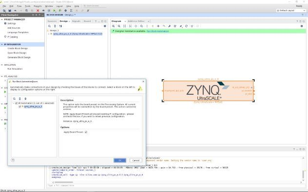
    
4.  The next thing we want to set up is a slave and master AXI port to connect our PS to the Sobel module we created. To do this, double click on the PS block. Then go to, **PS-PL Configuration** > **PS-PL Interfaces** > **Master Interface** and select one of the options. Then go to **Slave Interface** > **AXI HP** and select one of the options

    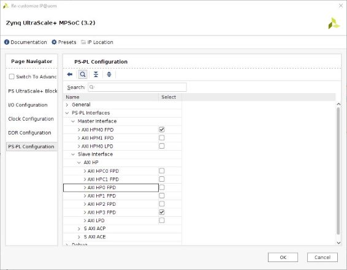
    
5. Now we add the Sobel module we created. To do so navigate to the menu you would normally select the IP you want and search for the name of the top function that you specified in Vivado HLS. In our case, this is Krnl_sobel. Add this to the block design.
    
    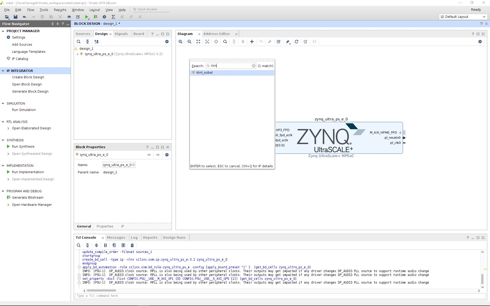
    
6. Click the 'Run Connection Automation' link from the pop-up that appears. This will add in the necessary connection blocks that we need to be able to use the Sobel module. Make sure all the boxes are checked before pressing **OK**.
    
    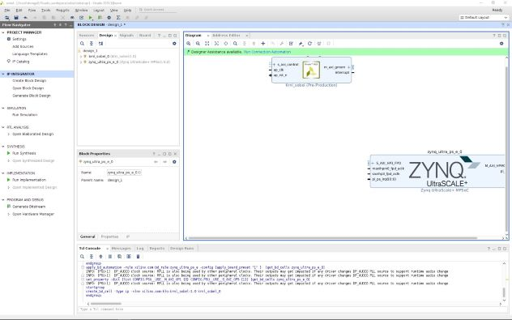
    
7. The block design should now look as such:
    
    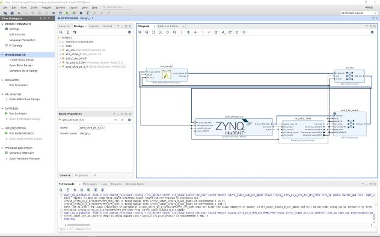
    
### Step 3 - Generating the Bitstream

1.  Generating the bitstream is an easy task, but first, we need to validate our design. Select the **Validate Design** option from the top of the **Diagram** window or press **F6**. If this was done correctly, it should tell you that a slave AXI port was excluded. 
    
    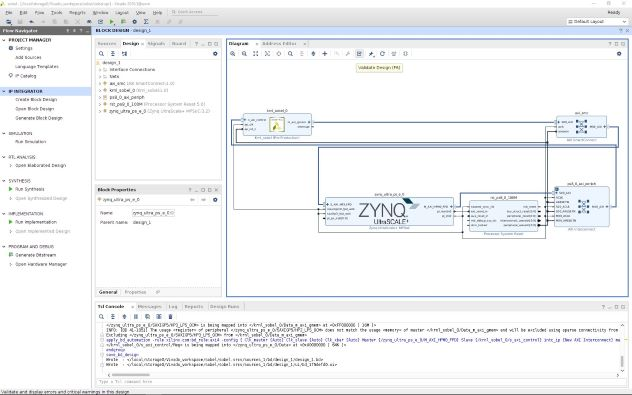
    
    This can be fixed by going the **Address Editor** tab and opening the sobel module section and then the **Excluded Address Segments**. To fix the validation issue, simply right-click the excluded address segment and select **Include Segment**.
    
    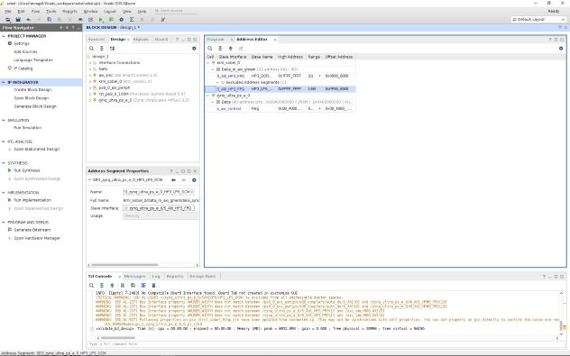
    
2.  Re-validate the design
3.  Before we can generate the bitstream we need to create an HDL wrapper for our design. This is easy to do. Go to the sources menu on the Vivado screen, right-click on the design file you want to create the wrapper for and select 'Create HDL Wrapper'. Keep all as default and select **OK**.     
    
    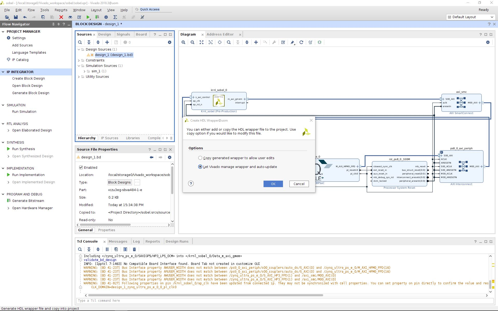
    
4.  Select **Generate Bitstream** from the Flow Navigator menu. Keep everything as default and click **OK**. This step will take some time, so go and grab a drink and come back.
5.  To find the bitstream, navigate to the directory you created for the project. For us, we will navigate to **sobel.runs/impl_1/design_1_wrapper.bit**. Note, sobel is the name of our directory, this will be replaced with whatever you named the directory.
6.  Once you've found the .bit file we need to convert the image file that we can load onto the FPGA. To do this we use Xilinx's Bootgen. This is straightforward to do. Preferably in the same directory as you found the .bit file, create a file called bitstream.bif. Its contents should be as follows:
```
all:
{
  design_1_wrapper.bit
}
```
7.  Once the bitstream.bif file is created, all you need to do is run the following command:
```
bootgen -image bitstream.bif -arch zynqmp -o bitstream.bin -w
```

## Misc 

This section contains helpful modifications that you may need or want during development

### 32 and 64 bit interfaces
Using the original Sobel OpenCL code, the data bus is 512 bits. For us, this is still usable but it could be changed. To do so, we changed the function parameter list to pass ints and int pointers, depending on the variable. We then took the input parameters and cast them into new variables of the original types. This allowed us to control the width of the data bus.

In order a 64 bit data bus, you just need to add an option to the configuration in HLS before synthesis. In Vivado HLS, click on the two yellow cogs called **Solution Settings...**, go to **Add** and select **config_interface** from the **Command** drop-down menu. Ensure that the **m_axi_addr64** option is selected.

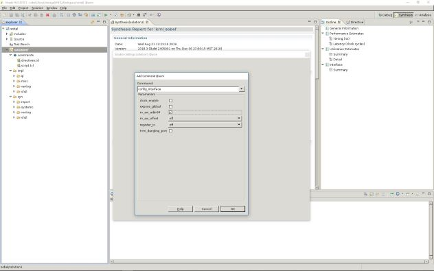

Now after synthesis, your data buses should be 64 bits wide

**N.B.** Remember that if you create a 64 bit interface, the modules internal registers will be 64 bits. You need to set those upper 32 bits to 0, otherwise, the module will use whatever value is stored in upper 32 bits and result in arbitrary behaviour.

### Master and Slave AXI Pragma in HLS
#### Master Pragmas
If you find you need to map an argument to the memory port, the basic structure is as follows:
```C
#pragma HLS INTERFACE m_axi port=<variable_name> offset=slave bundle=gmem
```
Variable_name is a variable that denotes an array. It should be noted that you should only map arrays to the memory ports

#### Slave Pragmas
If you find you need to map an argument to the control port, the basic structure is as follows:
```C
#pragma HLS INTERFACE s_axilite port=<variable_name> bundle=control
```
What these allowed us to do was map variables, both input and output, to registers within the hardware module. Which in turn, allowed us to tell the module where to find the data it needed.
It should be noted that a pragma should be created for return:
```C
#pragma HLS INTERFACE s_axilite port=return bundle=control
```

## Known Issues
  - There is a bug in Vivado HLS 2018.3, such that, sometimes, you will have to create a new project in order to see the changes to the interface
  - Can only test single work-group for OpenCL kernels. 

[Return to Top](#hls-to-static-bitstream)
