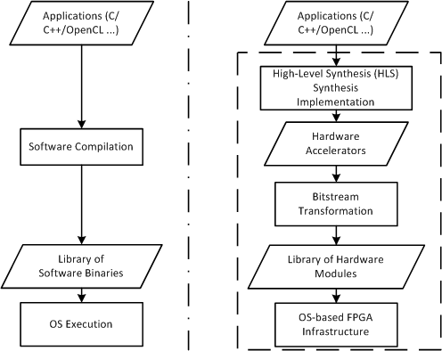
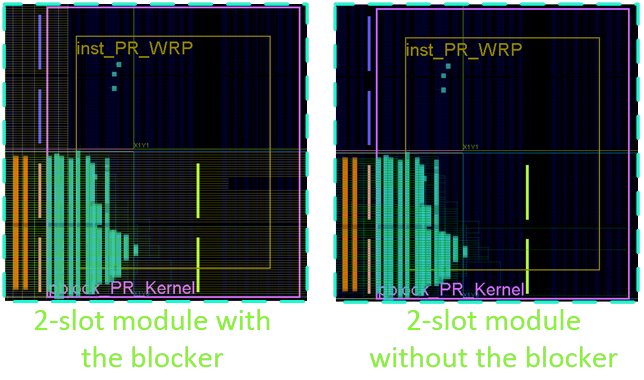
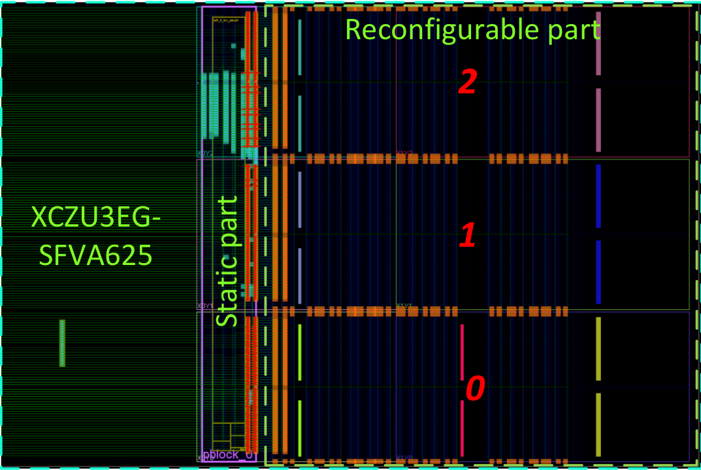

# Generating Partially Reconfigurable Modules

## Introduction
This document provides a short tutorial on how to compile partially reconfigurable modules 
for the ZUCL shell on Ultra96/UltraZed board using Vivado 2018.2, BitMan and tedtcl lib. Before you start following this tutorial please ensure dependent software components are configured correctly.

If you plan to use the runtime software provided in this repo, you do not need to generate a bitstream for each slot. The relocation function provided in the daemon and libs can perform this at runtime for you. 

**Make sure of the following before starting the compilation process:**
- you use the 64-bit address for AXI
- have selected the right data-width (32/128) bit for IP
- installed/imported tedtcl library



### Useful Links
  - [Examples, drivers and datafiles](https://www.dropbox.com/sh/qsg5m7jp1sn4saj/AABAzSGOa91K0Kvtlz_0LuRta?dl=0)
  - [Petalinux 2018.2](https://www.xilinx.com/support/download/index.html/content/xilinx/en/downloadNav/embedded-design-tools/archive.html)
  - [Vivado 2018.2](https://www.xilinx.com/support/download/index.html/content/xilinx/en/downloadNav/vivado-design-tools/archive.html)
  
## Generating PR Accelerators
### Synthesise the Module Out-Of-Context
We start the process by synthesising the module's RTL code to be an out-of-context module. Note, this RTL can be generated via [Vivado HLS for HLS accelerators](../hls/).

1.  Create a Vivado project with the sources and IPs
2.  In Vivado, use the following TCL comments:
    - *synth_design -mode out_of_context -flatten_hierarchy rebuilt -part xczu3eg-sbva484-1-e -top* {**module's top name**}
    - *write_checkpoint -force ./Synth/reconfig_modules/*{**module's top name**}
    - *close_design*
    - *close_project*

### Use TedTCL library
We have compressed the TedTCL library into the tedtcl.zip file for a lightweight repository. However, as this library is essential for the coming steps, we will show here how to use it in the process:

1. Unzip the tedtcl.zip file.

2. Put the below TCL commands into either your {path to Vivado 2018.2}/scripts/Vivado_init.tcl or the pr_module_xx.tcl:
*lappend auto_path {path to tedtcl}
package require ted*

### Implement the PR Module Using Blocker Templates
In this step, we are going to physically implement the module nased on provided blocker templates. We have templates for modules occupying 1, 2 or 3 slots. The AXI interfaces between the module and the static system is pre-placed and pre-routed in clock row Y0.

For this tutorial, we are using a 32-bit AXI Lite slave port and 32-bit AXI full master port. The same process can be applied for the 128-AXI shell available in repo.  

1.  Based on the module synthesis report, choose how many slots are needed. The available resources per slot can be found in the following table:

    | Available Resources | Numbers |
    |---------------------|---------|
    | CLB LUTs            | 17760   |
    | RAMB36/FIFO         | 60      |
    | RAMB18              | 120     |
    | DSPs                | 96      |
    
2.  According to the neccesary resources, choose to run: *pr_module_1_slot.tcl, pr_module_2_slots.tcl,* or *pr_module_3_slots.tcl*.
    - Change the top module to the module name: **set top_module xx**
    - *source ./pr_module_xx.tcl*

This will run the entire logic synthesis, as well as the physical implementation all the way to a (full) bitstream. The implementation scripts will use blocker macros (provided as DCPs) that constrain the routing of the module in strict bounding boxes.

The physical implementation results are as the following figure:



### Merge the PR Module into the Given Static Design Bitstream
Now, we start merging the PR module to the static design at bitstream level. The static design is as the following figure:



The tool BitMan is used to conduct this step:
1.  Merging the PR module which is allocated in Slot 0 to the static:
    - `bitman_linux -m 21 0 99 59 ./{module’s top name}_full.bit ./Ultra96_100MHz.bit -F ./Merge_{module’s top name}_Ultra96_100MHz.bit`
2.  Merging the PR module which is allocated in both Slot 0 and 1 to the static: 
    - `bitman_linux -m 21 0 99 119 ./{module’s top name}_full.bit ./Ultra96_100MHz.bit -F ./Merge_{module’s top name}_Ultra96_100MHz.bit`
3.  Merging the PR module which is allocated in Slot 0, 1 and 2 to the static:
    - `bitman_linux -m 21 0 99 179 ./{module’s top name}_full.bit ./Ultra96_100MHz.bit -F ./Merge_{module’s top name}_Ultra96_100MHz.bit`
    
The three commands are essentially the same and only differ in the number of slots that are cut out from the (full) module configuration bitstream that is then merged into the full static bitstream (*Ultra96_100MHz.bit*). This process is carried out in a way that will not touch the routing information of the global clock resources.

### Create Partial Bitstreams from the Merged Full Bitstream
The partial bitstreams can be extracted from the aforementioned merged bitstream by the following BitMan commands: 

1.  In order to cut out the module and place it in one of the three slots, use one of the following lines. This will generate the corresponding partial bitstreams:
    - `bitman_linux -x 21 0 99 59 ./Merge_{module’s top name}_Ultra96_100MHz.bit -M 21 0 ./Partial_{module’s top name}_Slot_0.bit`
    - `bitman_linux -x 21 60 99 119 ./Merge_{module’s top name}_Ultra96_100MHz.bit -M 21 60 ./Partial_{module’s top name}_Slot_1.bit`
    - `bitman_linux -x 21 120 99 179 ./Merge_{module’s top name}_Ultra96_100MHz.bit -M 21 120 ./Partial_{module’s top name}_Slot_2.bit`
    
    Note that as the bitstream relocation is supported by at run-time, the user may not need to generate all three bitstreams for three slots but one bitstream of any slot.
    
2. To perform the same for placing a two-slot module use:
    - `bitman_linux -x 21 0 99 119 ./Merge_{module’s top name}_Ultra96_100MHz.bit -M 21 0 ./Partial_{module’s top name}_Slot_0_1.bit`
    - `bitman_linux -x 21 0 99 119 ./Merge_{module’s top name}_Ultra96_100MHz.bit -M 21 60 ./Partial_{module’s top name}_Slot_1_2.bit`
    
3.  To perform the same for place a three-slots module use:
    - `bitman_linux -x 21 0 99 179 ./Merge_{module’s top name}_Ultra96_100MHz.bit -M 21 0 ./Partial_{module’s top name}_Slot_0_1_2.bit`
      
These are all Xilinx-compatible partial bitstreams. However, in order to use PCAP to load those partial bitstreams onto an FPGA at runtime, we need to convert them to another Xilinx format. This step is automatically done by the Xilinx SDK tool (installed with Vivado Design Suite). We follow the following steps:

1. Create a Bitstream.bif file, containing the following:
```
all:
{
    {Bitstream file name}.bit
}
```
2. Put the below command into the XSCT console or terminal after sourcing SDK settings:
```
bootgen -image Bitstream.bif -arch zynqmp -o ./{module's top name}_Slot.bin -w
```

## Misc
When you synthesise the module out-of-context you may want to use the following instruction instead:
- *Copy the VHDL folder from your Vivado HLS project to the ./Sources folder*
- *read_vhdl* {**list of all the contents in the vhdl folder**}
